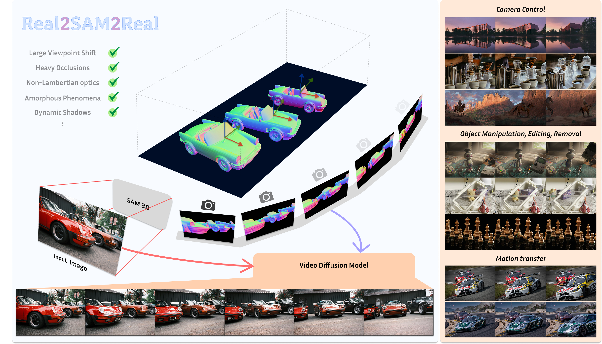

# Real2SAM2Real: Generative 3D Caches as Complementary Context for Video Diffusion

[Jiayi Wu](https://jiayi-wu-leo.github.io/)\*, [Haoming Cai](https://www.hm-cai.com/)\*, [Cornelia Fermuller](https://robotics.umd.edu/clark/faculty/1168/Cornelia-Ferm%C3%BCller), [Christopher Metzler](https://www.cs.umd.edu/people/metzler), [Yiannis Aloimonos](https://robotics.umd.edu/clark/faculty/350/Yiannis-Aloimonos)

University of Maryland, College Park &nbsp;·&nbsp; \*Equal contribution

[Paper](https://arxiv.org/pdf/2606.00299) · [arXiv](https://arxiv.org/abs/2606.00299) · [Project Page](https://jiayi-wu-leo.github.io/) · [Model](https://huggingface.co/JiayiWuLeo/Real2SAM2Real) · [Video](https://www.youtube.com/watch?v=yWS7gLoLiXM)



<p align="center">
  <video src="https://jiayi-wu-leo.github.io/real2sam2real/out/video.mp4" controls muted loop playsinline width="720"></video>
</p>

> If the video above does not play, watch it on [YouTube](https://www.youtube.com/watch?v=yWS7gLoLiXM).

---

## TL;DR

**Real2SAM2Real** is a 3D-aware video generation framework that integrates a generative 3D cache to provide video diffusion models (VDMs) with instance-complete geometric guidance. It enables precise, decoupled control over camera trajectories and multi-entity motions, prevents structural collapse under complex camera shifts and severe occlusions, and remains robust on non-Lambertian surfaces, fluids, and other complex phenomena.

## Abstract

Real2SAM2Real is a 3D controllable video generation framework featuring an explicitly editable 3D cache that enables precise control over both cameras and scenes. Existing methods predominantly rely on implicit diffusion priors to generate unobserved regions, inevitably leading to structural collapse during high-dynamic movements or complex occlusions. To address this, our framework leverages 3D lifting models (e.g., SAM3D) to extract this explicitly editable 3D cache, serving as a robust geometric scaffold for the VDM. By capturing the entire 3D volume of foreground entities rather than just their visible shells, this cache injects holistic spatial priors into the VDM, providing dependable 3D-aware guidance for complex scene dynamics. To effectively leverage this 3D guidance while preserving pre-trained priors, we design a Soft Spatial-Aligned Injection mechanism alongside a minimally invasive fine-tuning strategy tailored for VDMs. Furthermore, we employ masked normal maps as a cross-modal bridge to construct a 3D-free data curation and perturbation pipeline.

---

## TODO

- [ ] Inference code
- [ ] Training code
- [ ] Model weights

---

## Citation

```bibtex
@article{wu2026real2sam2real,
  title   = {Real2SAM2Real: Generative 3D Caches as Complementary Context for Video Diffusion},
  author  = {Wu, Jiayi and Cai, Haoming and Fermuller, Cornelia and Metzler, Christopher and Aloimonos, Yiannis},
  journal = {arXiv preprint arXiv:2606.00299},
  year    = {2026}
}
```

## License

This project is released under the [Apache License 2.0](LICENSE).
