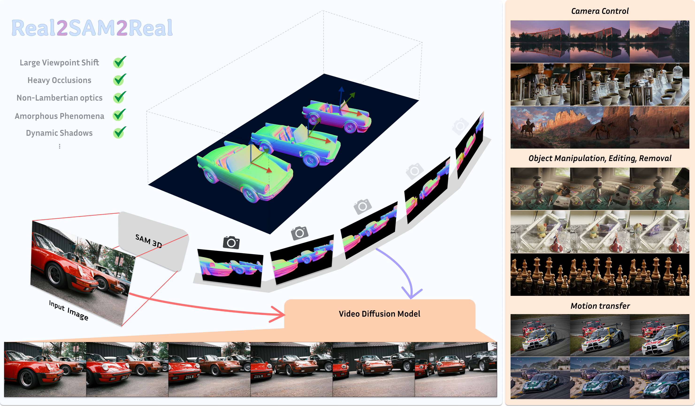

<div align="center">

# Real2SAM2Real: Generative 3D Caches as Complementary Context for Video Diffusion

<p>
  <a href="https://jiayi-wu-leo.github.io/">Jiayi Wu</a><sup>*</sup> &nbsp;·&nbsp;
  <a href="https://www.hm-cai.com/">Haoming Cai</a><sup>*</sup> &nbsp;·&nbsp;
  <a href="https://robotics.umd.edu/clark/faculty/1168/Cornelia-Ferm%C3%BCller">Cornelia Fermüller</a> &nbsp;·&nbsp;
  <a href="https://www.cs.umd.edu/people/metzler">Christopher Metzler</a> &nbsp;·&nbsp;
  <a href="https://robotics.umd.edu/clark/faculty/350/Yiannis-Aloimonos">Yiannis Aloimonos</a>
</p>

**University of Maryland, College Park** &nbsp;·&nbsp; <sup>*</sup>Equal contribution

[](https://jiayi-wu-umd.github.io/Real2SAM2Real/)
[](https://arxiv.org/abs/2606.00299)
[](https://huggingface.co/JiayiWuLeo/Real2SAM2Real)
[](https://github.com/jiayi-wu-umd/Real2SAM2Real)
[](https://www.youtube.com/watch?v=yWS7gLoLiXM)

</div>

---

> **TL;DR** — Real2SAM2Real is a 3D-aware video generation framework that integrates a
> generative 3D cache to provide video diffusion models with instance-complete geometric
> guidance. This enables precise, decoupled control over both camera trajectories and
> multi-entity motions, preventing structural collapse under complex camera shifts and
> severe occlusions. By fully decoupling geometry and appearance conditions, it stays
> robust even for non-Lambertian surfaces, fluids, and other complex phenomena.

<div align="center">

</div>

## Overview

Real2SAM2Real is a 3D-controllable video generation framework featuring an explicitly
editable **3D cache** that enables precise control over both cameras and scenes. Existing
methods predominantly rely on implicit diffusion priors to hallucinate unobserved regions,
which leads to structural collapse during high-dynamic movement or complex occlusions. To
address this, we use 3D lifting models (e.g., SAM3D) to extract an explicitly editable 3D
cache that serves as a robust geometric scaffold for the video diffusion model (VDM). By
capturing the entire 3D volume of foreground entities rather than just their visible
shells, this cache injects holistic spatial priors into the VDM. To leverage this guidance
while preserving pretrained priors, we design a **Soft Spatial-Aligned Injection** mechanism
with a minimally invasive fine-tuning strategy, and use **masked normal maps** as a
cross-modal bridge for a 3D-free data-curation and perturbation pipeline. By decoupling
geometry from appearance, the VDM-tailored 3D cache removes perspective ambiguities from
structural holes and erroneous facades, as well as misleading cues from reflections and
refractions.

---

## Quickstart

```bash
# 0. Environment (Python >= 3.10 + CUDA-capable PyTorch)
conda create -n real2sam2real python=3.11 -y && conda activate real2sam2real

# 1. Clone this repo
git clone https://github.com/jiayi-wu-umd/Real2SAM2Real.git
cd Real2SAM2Real

# 2. Clone + pin VideoX-Fun, install deps
bash setup.sh

# 3. Download base model + trained weights
pip install -U "huggingface_hub[cli]"
bash download.sh

# 4. Run the demo
bash demo.sh
```

Output → `output/checkpoint-infer/<scene>/<camera>/generated.mp4`.

Run on your own scenes by pointing `DATA_ROOT` at a folder of samples:
`DATA_ROOT=/path/to/scenes bash demo.sh`.

To reuse an existing VideoX-Fun checkout instead of the one `setup.sh` clones,
set `VIDEOX_FUN_ROOT=/path/to/VideoX-Fun`.

---

## Input format

`infer.py` discovers samples by walking `DATA_ROOT` for directories two levels
deep (`<scene>/<camera>/`) containing:

| File | Required | Description |
|------|----------|-------------|
| `source_image.png`            | yes | Reference image of the real scene |
| `object_animation_normal.mp4` | yes | Normal-map control video |
| `caption.json`                | no  | `{"text": "<prompt>"}`; used as the text prompt if present |

Ready-to-run examples are bundled under `assets/demo/` and are what `demo.sh`
runs by default (`DATA_ROOT=assets`, so each sample resolves as
`<scene>/<camera>` = `demo/<name>`):

```
assets/demo/
├── camera_control/                  # camera control: orbit around parked Porsche 911s
│   ├── source_image.png
│   ├── object_animation_normal.mp4
│   └── caption.json
├── camera_control_lego/             # camera control: orbit around walking LEGO minifigures (Abbey Road)
├── extreme_trajectory_street/       # extreme trajectory: low puddle-level track down a street
├── reflection_dresser_mirror/       # reflection: orbit past a mirror + glossy surfaces
├── object_manipulation_chair/       # object manipulation: an office chair rotates in place
├── object_removal_chess/            # object removal: one chess pawn slides, rest stay put
├── motion_transfer_car_a/           # motion transfer: 3 samples share ONE normal video
├── motion_transfer_car_b/           #   (identical control motion) but use different
└── motion_transfer_car_c/           #   source images + captions -> same motion, new look
```

The bundled examples cover the control modes:

- **Camera control** — a moving-camera normal video drives a static scene
  (orbit around parked cars).
- **Extreme trajectory** — large, aggressive camera moves that break diffusion-only
  methods (a low, puddle-level track down a city street).
- **Reflection & refraction** — geometry-appearance decoupling keeps mirrors and
  glossy surfaces consistent under camera motion (orbit past a mirrored dresser).
- **Object manipulation** — a per-object normal video moves one object while the
  background stays fixed (an office chair rotating in place).
- **Object removal** — the normal video keeps all objects but one static; the
  moved object clears its original spot (a chess pawn slides away).
- **Motion transfer** — one object-motion normal video is reused across different
  reference images: `motion_transfer_car_{a,b,c}` share an identical
  `object_animation_normal.mp4` but differ in `source_image.png` / `caption.json`,
  so the same motion transfers onto different appearances.

---

## Weights

Downloaded by `download.sh` from HuggingFace Hub:

- `lora_diffusion_pytorch_model.safetensors` — LoRA adapter (rank 64, α 32).
- `pose_patch_embedding.safetensors` — trained conv that injects the normal-map
  control into the transformer (**required** for the method).
- `lora_diffusion_pytorch_model_compatible_with_comfyui.safetensors` — the LoRA
  in kohya/ComfyUI key format. Loads in ComfyUI LoRA nodes, but note: full
  Real2SAM2Real inference also needs `pose_patch_embedding` + the normal-map
  injection path, which are not part of a standard ComfyUI workflow.

---

## License

Apache License 2.0 (`LICENSE`). Builds on VideoX-Fun (Apache 2.0) and
Wan2.2-Animate-14B (see its model card for terms).

---

## Citation

If you find Real2SAM2Real useful, please cite:

```bibtex
@article{wu2026real2sam2real,
  title={Real2SAM2Real: Generative 3D Caches as Complementary Context for Video Diffusion},
  author={Wu, Jiayi and Cai, Haoming and Fermuller, Cornelia and Metzler, Christopher and Aloimonos, Yiannis},
  journal={arXiv preprint arXiv:2606.00299},
  year={2026}
}
```

## Acknowledgements

Built on [VideoX-Fun](https://github.com/aigc-apps/VideoX-Fun) and
[Wan2.2-Animate](https://huggingface.co/Wan-AI/Wan2.2-Animate-14B). Our 3D cache
uses [SAM3D](https://github.com/facebookresearch/sam-3d-objects)-style geometry lifting.
